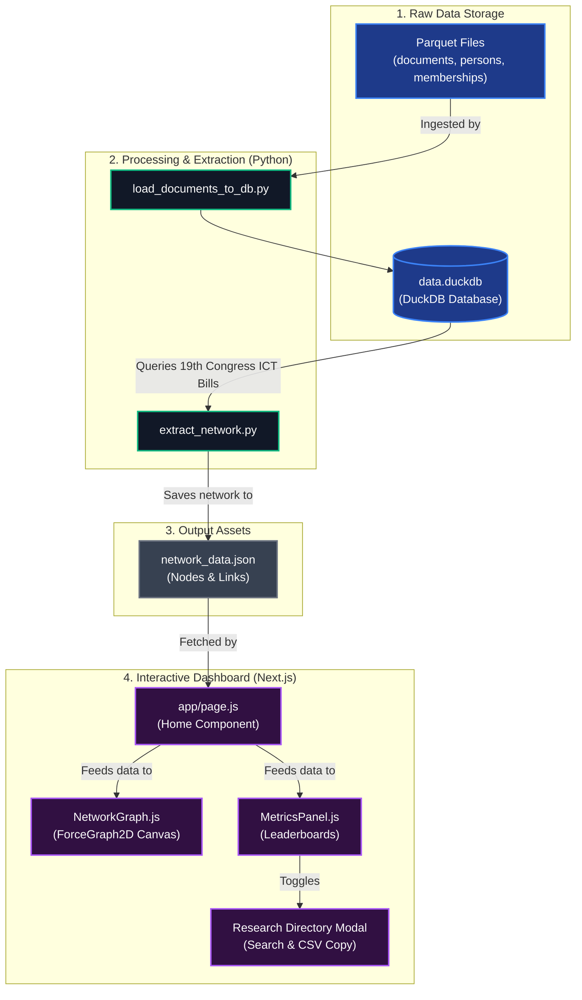

# Legislative Collaboration Network - System Architecture

This document describes how the Legislative Collaboration Network pipeline and interactive dashboard operate, from raw data extraction to frontend visualization.

---

## 📊 System Overview & Data Flow

The system is structured as a two-stage data pipeline:
1. **Data Processing Pipeline (Python & DuckDB)**: Ingests documents, extracts co-authorship relationships, calculates graph-theoretic centrality metrics, and exports them.
2. **Interactive Visualization Dashboard (Next.js & React)**: Reads the exported JSON and provides researchers with interactive graphs, centrality directory listings, and export capabilities.



---

## 🛠️ Component Breakdown

### 1. Data Ingestion & Storage
- **Source Files**: The data resides in `.parquet` files (`documents.parquet`, `persons.parquet`, `memberships.parquet`) containing bills metadata, content, and senator biographical details.
- **Database (`data.duckdb`)**: Parquet files are loaded into a local DuckDB instance using `load_documents_to_db.py` and `load_persons_to_db.py` for highly efficient analytical queries.

### 2. Network Extraction Pipeline (`extract_network.py`)
This Python script uses `duckdb` for querying and `networkx` for graph computation. It executes the following steps:
1. **Querying**: Filters Senate Bills (`sb`) of the **19th Congress** containing ICT-relevant keywords:
   ```sql
   SELECT document_number, content FROM documents 
   WHERE congress = 19 
     AND document_type = 'sb' 
     AND (content ILIKE '%digital%' 
          OR content ILIKE '%cyber%' 
          OR content ILIKE '%internet%' 
          OR content ILIKE '%technology%' 
          OR content ILIKE '%telecommunication%')
   ```
2. **Entity Recognition**: Scans the first 1500 characters of each bill's text (where authors are declared after "Introduced by") and applies regular expression patterns corresponding to each of the 24 senators.
3. **Graph Construction**:
   - **Nodes**: Mapped to senators. An attribute `billsCount` tracks the total number of ICT bills they authored or co-authored.
   - **Edges**: Formed between senators who co-sponsor the same bill. The edge `weight` is incremented with each shared bill.
4. **Graph Metrics Calculation**:
   - **Degree Centrality**: The proportion of all other senators that a senator has co-authored a bill with.
   - **Betweenness Centrality**: Measures how frequently a senator lies on the shortest path between other senators in the network, representing who acts as a critical "bridge" or gatekeeper.
   - **Louvain Modularity**: Partitions the graph into "Collaboration Blocs" (communities of senators who sponsor bills with each other more frequently than with outsiders).
5. **Output**: Saves nodes and edge configurations directly to `dashboard/public/network_data.json`.

### 3. Frontend Dashboard
Built with Next.js (React 19) and Tailwind CSS:
- **`app/page.js`**: Fetches the processed `network_data.json` client-side and coordinates the active `selectedNode` state.
- **`components/NetworkGraph.js`**: Renders the 2D network using HTML5 Canvas (`react-force-graph-2d`).
  - **Node Color Modes**: Toggleable between **Collaboration Blocs** (algorithmic) and **Political Parties** (official).
  - **Node Sizing Mode**: Scaled linearly by **Shared Bills** or **Degree Centrality**.
  - **Tooltip**: Displays degree, betweenness, and shared bills.
- **`components/MetricsPanel.js`**: Displays network-wide metrics (nodes count, links count, density) and a quick leaderboard.
- **`Research Directory Modal (RaD)`**: Provides researchers with a complete tabular overview of all metrics. It allows searching, sorting, and downloading the metrics as CSV.

---

## 📈 Centrality Definitions & Analytical Value

| Metric | Definition | Legislative Implication |
| :--- | :--- | :--- |
| **Degree Centrality** | Connection density relative to maximum possible connections. | Indicates **collaboration reach**; how widely a senator works across the senate floor. |
| **Betweenness Centrality** | Proportion of shortest paths passing through a node. | Indicates **intermediary power**; senators who connect isolated factions or bridge partisan divides. |
| **Shared Bills (Bills Count)** | Total count of bills a senator authored or co-authored. | Indicates **legislative volume**; how active a senator is in drafting ICT policy. |
| **Collaboration Blocs** | Modularity-based node partitioning. | Identifies **de-facto coalitions**; networks of senators who vote and sponsor collectively, regardless of party lines. |
